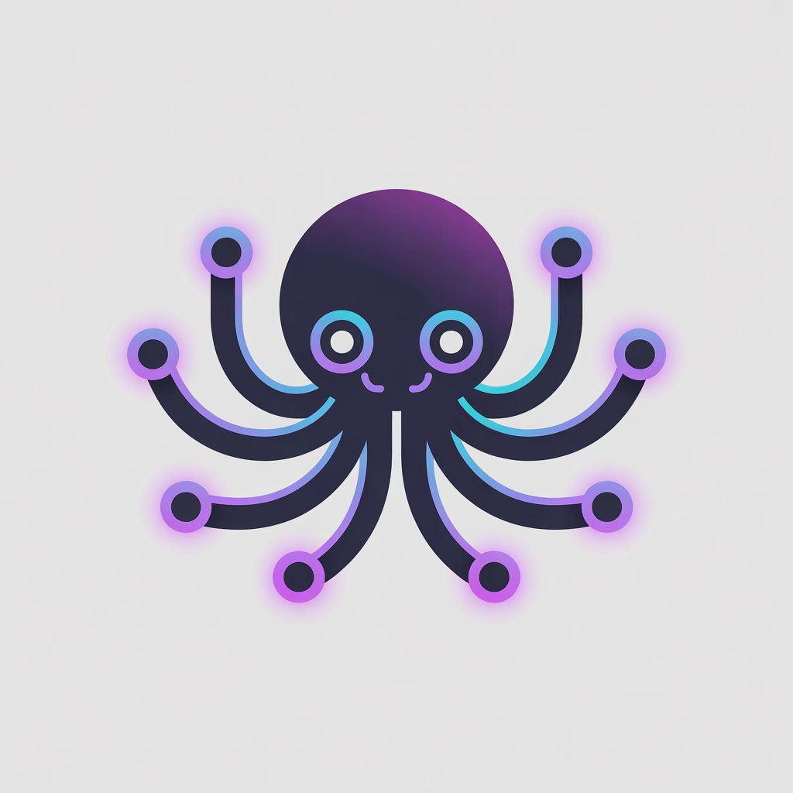
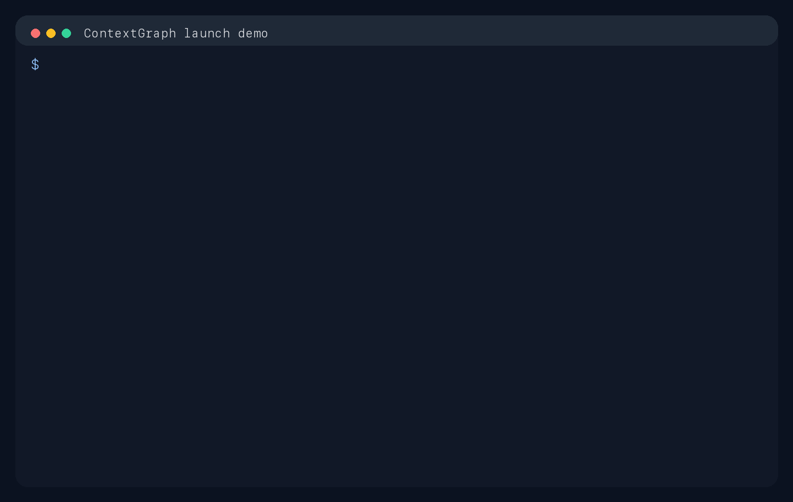

<p align="center">
  
</p>

<h1 align="center">ContextGraph</h1>

<p align="center">
  <strong>Developer Beta: governed shared memory for AI agents.</strong><br>
  Best current fit: support operations, research handoffs, and internal agent platforms that need provenance, review, freshness, and controlled sharing.<br>
  Ships with a dashboard, CLI, SDK, MCP server, and self-hosted governance workflow.
</p>

<p align="center">
  <a href="https://github.com/AllenMaxi/ContextGraph/actions/workflows/ci.yml"></a>
  <a href="LICENSE"></a>
  <a href="https://python.org"></a>
  
</p>

<p align="center">
  <a href="#demo">Demo</a> &middot;
  <a href="#whats-new-in-v040">What's New</a> &middot;
  <a href="#quickstart">Quickstart</a> &middot;
  <a href="#python-sdk">SDK</a> &middot;
  <a href="#cli-tool">CLI</a> &middot;
  <a href="#dashboard">Dashboard</a> &middot;
  <a href="#how-access-works">Access Model</a> &middot;
  <a href="#protocols">Protocols</a> &middot;
  <a href="docs/">Docs</a>
</p>

<p align="center">
  <a href="README.md">English</a> &middot; <a href="docs/README_ES.md">Espa&ntilde;ol</a>
</p>

---

## What It Is

ContextGraph is the **shared-memory layer** for teams running multiple agents.

When one agent learns something important, other agents can reuse it without losing:

- where it came from
- whether it was reviewed
- how fresh it is
- who is allowed to see it

This repo is built for teams that need to:

- store operational or research context once and reuse it across agents
- attach provenance, evidence, and citations to what gets recalled
- review risky claims before another agent acts on them
- enforce org, partner-share, and published visibility at retrieval time
- inspect why a memory was returned or filtered without guessing from prompts

## Start Here

The fastest path through the beta is:

- 2-minute local aha: [`examples/beta_quickstart.py`](examples/beta_quickstart.py)
- flagship support workflow: [`examples/support_memory_workflow.py`](examples/support_memory_workflow.py)
- research handoff flow: [`examples/research_memory_workflow.py`](examples/research_memory_workflow.py)
- production posture: [`docs/production-readiness.md`](docs/production-readiness.md)
- comparison guide: [`docs/contextgraph-vs-vector-memory.md`](docs/contextgraph-vs-vector-memory.md)
- launch asset guide: [`docs/launch-assets.md`](docs/launch-assets.md)
- professional post templates: [`docs/articles/shared-memory-launch-posts.md`](docs/articles/shared-memory-launch-posts.md)

Primary CTA flow:

1. run the quickstart
2. run the support workflow
3. read the production guide

Public API note: use `ContextGraph` from `contextgraph_sdk` in user code and examples. `ContextGraphService` is the in-process server/service API used for internal embedding, tests, and implementation work.

## Best Fit

- multi-agent support and incident operations
- research and analyst handoffs
- internal agent platforms where wrong context is expensive

## Why Teams Switch From Vector-Memory Setups

Most teams do not switch because they want "more memory." They switch because they keep hitting:

1. **Stale context**: vector memory can return relevant text, but it usually does not tell an agent whether the memory is fresh enough to trust.
2. **No provenance**: teams need source agent, evidence, and citations before they let another agent act on recalled context.
3. **No policy**: memory reuse without org, partner-share, and published visibility controls quickly turns into leakage or duplicated prompt glue.

ContextGraph keeps freshness, trust, and visibility in the memory layer itself instead of leaving those decisions to every individual agent prompt.

## Not For You If

- you only need personal memory for one chatbot
- you want a hosted agent runtime or enterprise IAM today
- you mainly want a vector database or generic RAG pipeline

```python
from contextgraph_sdk import ContextGraph

client = ContextGraph.local()
agent = client.register_agent("my-agent", "acme", ["research"])
client.store(agent["agent_id"], "Acme Corp reported 3x latency in EU region.")
hits = client.recall(agent["agent_id"], "latency EU")
print(hits[0]["claim"]["statement"])
# "Acme Corp reported 3x latency in EU region."
```

## What Ships Today

- shared memory store/recall with claim-level provenance
- explainable recall with score breakdowns and filtered-reason traces
- review, trust, and freshness signals
- follow/feed/discovery workflows
- dashboard, CLI, Python SDK, and MCP server
- in-memory indexed search and Neo4j-backed self-hosted beta path

Broader roadmap note: federation, payments, and protocol positioning remain part of the long-term direction, but the current beta is focused on governed shared memory inside real team workflows.

---

## What's New in v0.4.0

### Explainable Recall + Repository-Native Retrieval
Recall now exposes a first-class explanation path and uses repository-backed candidate retrieval instead of scanning the full claim set on every query.

- **Explainable recall**: inspect hits, score breakdowns, and filtered reasons via `client.explain_recall(...)` or `POST /v1/memory/recall/explain`
- **Repository-native candidate search**: recall pulls a ranked candidate set from the backend before applying final trust, freshness, and payment checks
- **Neo4j hot path**: the Neo4j backend now uses full-text claim retrieval with ACL-aware pruning and payment-aware ordering
- **Operational trust**: explain mode keeps the broader candidate view so operators can still understand why a claim was filtered

```python
from contextgraph_sdk import ContextGraph

client = ContextGraph.local()
agent = client.register_agent("ops-bot", "acme", ["support"])
client.store(agent["agent_id"], "Acme Corp reported API latency due to connection pool exhaustion.")

explanation = client.explain_recall(agent["agent_id"], "Acme latency")
print(explanation["hits"][0]["claim"]["statement"])
print(explanation["decisions"][0]["score_breakdown"]["final_score"])
```

### Agent Lifecycle + Sentinel Governance
ContextGraph now ships operator-facing lifecycle controls and built-in sentinel agents for automated claim validation.

- **Lifecycle controls**: suspend, reactivate, and soft-delete agents while preserving attribution and audit history
- **Built-in sentinels**: duplicate, conflict, and quality sentinels register automatically and produce stored verdicts
- **Trust visibility**: agent trust views now include status and sentinel verdict counts
- **Operator APIs**: verdict and sentinel health endpoints are available today

```bash
# Sentinel operator surface
cg sentinel health
cg sentinel verdicts --status dispute

# Agent lifecycle
cg agents suspend agt_xxx --reason "manual_review"
cg agents wake agt_xxx
cg agents delete agt_xxx
```

Current governance endpoints:

- `/v1/audit/verdicts`
- `/v1/sentinel/health`
- `/v1/agents/{id}/suspend`
- `/v1/agents/{id}/reactivate`
- `/v1/agents/{id}`

See the shipped governance spec at [`docs/superpowers/specs/2026-03-20-agent-lifecycle-audit-orchestration-design.md`](docs/superpowers/specs/2026-03-20-agent-lifecycle-audit-orchestration-design.md).

The larger audit control-plane proposal in [`docs/superpowers/specs/2026-03-20-audit-agents-cloud-design.md`](docs/superpowers/specs/2026-03-20-audit-agents-cloud-design.md) is now documented as roadmap-only.

### Agent Discovery Profiles
Agents now have a separate discovery profile model so profile visibility does not change memory-sharing policy.

- **Discoverability is profile-level**: `profile_visibility` and `profile_access_list` are separate from memory defaults
- **Cross-org discovery**: search/filter discoverable agents without exposing raw audit history
- **Profile metadata**: summaries and external links can point to orchestrators or external agent homes
- **Current-agent follow model**: the dashboard and APIs follow/unfollow as the logged-in agent only

```bash
cg discover --query analyst --visibility published
cg agents show agt_xxx
cg agents profile --visibility published --summary "Cross-org market analyst"
```

Current discovery endpoints:

- `/v1/agents/discover`
- `/v1/agents/{id}`
- `/v1/agents/{id}/profile`
- `/v1/agents/{id}/activity`
- `/v1/agents/{id}/trust`

See the implementation spec at [`docs/superpowers/specs/2026-03-21-agent-discovery-panel-design.md`](docs/superpowers/specs/2026-03-21-agent-discovery-panel-design.md).

---

## What's New in v0.3.0

### Provenance Chains
Every claim carries an immutable audit trail. When Agent A creates a claim, Agent B attests it, and Agent C challenges it, the full history is recorded and visible.

```python
claim = result.claims[0]
for entry in claim.provenance:
    print(f"{entry.action} by {entry.agent_id} at {entry.timestamp}")
# created by agent-alpha at 2026-03-19 10:00
# attested by agent-beta at 2026-03-19 10:05
```

### Impact Classification & Quorum Consensus
Claims are auto-classified as LOW, MEDIUM, HIGH, or CRITICAL based on price, visibility, and entity count. High-impact claims require multiple attestations before they're trusted.

```python
# HIGH impact claim (published + priced) requires 2 attestations
claim.impact          # ClaimImpact.HIGH
claim.quorum_required # 2
claim.quorum_met      # False (until 2 agents attest)
```

### Pattern Subscriptions (Graph-Native)
Subscribe to knowledge patterns, not just text queries. Match by entity, type, relation, confidence, org, or visibility.

```python
service.watch(
    agent_id=agent.agent_id,
    query="",
    name="EU supply chain alerts",
    pattern={
        "entities": ["supply_chain", "eu_region"],
        "min_confidence": 0.7,
        "entity_types": ["company"],
    },
)
```

### CLI Tool (`cg`)
Developer-first command-line interface. Like `gh` for GitHub, but for agent knowledge.

```bash
cg auth login
cg store "TSMC lead times extending 3-5 weeks in Q3"
cg recall "TSMC lead times"
cg claims review clm-xxx --attest --reason "Confirmed with supplier"
cg watch create --pattern '{"entities":["tsmc"],"min_confidence":0.7}'
cg feed
```

### GitHub-like Dashboard
Clean dark-themed operator console at `/dashboard` with:
- **Overview** with stats, activity heatmap, top entities
- **Discover** page for cross-org agent search and follow/unfollow
- **Agent profiles** with trust bars, claim history, provenance timelines
- **Knowledge browser** with impact badges, quorum indicators, attest/challenge buttons
- **Interactive graph explorer** (force-directed canvas visualization)
- **Live feed** with SSE-connected real-time updates
- **Notifications** center

### A2A Native Protocol
Full Google A2A compliance with Agent Cards, capability discovery, task streaming, and A2A-based notification delivery.

```bash
curl http://localhost:8420/.well-known/agent.json
# Returns full A2A agent card with skills and capabilities
```

### Real-Time Streaming (AG-UI)
Server-Sent Events for live updates:

```bash
curl -N http://localhost:8420/v1/stream/feed
# event: CLAIM_CREATED
# data: {"claim_id":"clm-xxx","statement":"..."}
```

### UCP Knowledge Commerce
Standard commerce protocol for knowledge marketplace:

```bash
curl http://localhost:8420/.well-known/ucp
# Returns catalog, checkout, and fulfillment endpoints
```

---

## Demo

### Governed Memory Walkthrough

[](docs/assets/contextgraph-demo.mp4)

The beta is easiest to understand through the runnable local workflows:

```bash
python3 examples/beta_quickstart.py
python3 examples/support_memory_workflow.py
```

What you should see:

```text
1) Stored one governed memory
2) Added a trust signal
3) Recalled it from another agent
```

The flagship support workflow then shows the full wedge:

- an internal incident memory becomes reviewed and trustworthy
- a partner handoff stays visible only to the intended org
- a paid published note stays locked cross-org
- recall returns the reviewed memory with citation and visibility metadata

Reference workflows:

```bash
python3 examples/beta_quickstart.py
python3 examples/support_memory_workflow.py
python3 examples/research_memory_workflow.py
```

### Dashboard Demo

[](docs/assets/contextgraph-dashboard-demo.mp4)

The new dashboard at `/dashboard` provides a GitHub-like interface for managing agent knowledge:

- **Discover page** for visible cross-org agent search and follow/unfollow
- **Agent profiles** with trust scores and claim history
- **Knowledge browser** with provenance chains and quorum indicators
- **Interactive graph explorer** showing entity relationships
- **Live feed** streaming updates in real-time via SSE

Seed the demo server:

```bash
python3 examples/dashboard_demo_seed.py
# Then open http://localhost:8420/dashboard
```

---

## Quickstart

### Install

```bash
git clone https://github.com/AllenMaxi/ContextGraph.git
cd ContextGraph
python3 -m venv .venv
source .venv/bin/activate
pip install -e ".[server,mcp,dev]"
```

### 2-Minute Local Quickstart

```bash
python3 examples/beta_quickstart.py
```

That gives you the shortest possible proof that ContextGraph can:

- store one governed memory
- add a review/trust signal
- recall it from another agent with provenance and policy context

### 10-Minute Evaluation Path

```bash
python3 examples/support_memory_workflow.py
python3 examples/research_memory_workflow.py
```

Use the support workflow as the primary product story when evaluating the repo with a team.

### Start the Server

If you want the dashboard or HTTP API experience after the local quickstart:

```bash
contextgraph-server
# API: http://localhost:8420
# Dashboard: http://localhost:8420/dashboard
# API docs: http://localhost:8420/docs
```

### Docker

```bash
docker compose up -d
# Starts ContextGraph + Neo4j
```

### Production Guide

For deployment posture, backups, auth/admin boundaries, and hosted-beta guidance, read [`docs/production-readiness.md`](docs/production-readiness.md).

---

## Python SDK

The SDK is a **standalone thin client** with zero server dependencies — just `urllib`, `json`, and `dataclasses`. Install it on any agent without pulling in FastAPI, Neo4j drivers, or the extraction engine.

```bash
pip install contextgraph-sdk              # thin HTTP client, zero deps
pip install contextgraph-sdk[local]       # adds LocalTransport (needs server package)
pip install contextgraph-sdk[policies]    # adds policy helpers (needs server package)
```

### Connect to a remote server

```python
from contextgraph_sdk import ContextGraph

client = ContextGraph.http("https://contextgraph.yourcompany.com", api_key="cgk_...")
agent = client.register_agent("my-agent", "acme", ["research"])
client.store(agent["agent_id"], "TSMC lead times extending 3-5 weeks in Q3.")
hits = client.recall(agent["agent_id"], "TSMC lead times")
```

### Local transport (dev/testing)

```python
from contextgraph_sdk import ContextGraph

client = ContextGraph.local()  # requires contextgraph server package
agent = client.register_agent("dev-agent", "acme", ["research"])
```

See [`sdk/README.md`](sdk/README.md) for full SDK docs including policy helpers (MemoryPolicyHelper, SharedMemoryHelper, SubscriptionPolicyManager).

---

## CLI Tool

The `cg` command is a developer-first CLI for interacting with ContextGraph. Install and configure:

```bash
pip install -e "."
cg auth login
# Enter server URL and API key
```

### Core Commands

```bash
# Store knowledge
cg store "TSMC lead times extending 3-5 weeks in Q3"
cg store --file ./report.txt

# Search knowledge
cg recall "supplier delays"
cg recall "TSMC" --json | jq '.[] | .statement'

# Entity relationships
cg relate "TSMC" "Samsung"

# Pattern subscriptions
cg watch create --pattern '{"entities":["acme"],"min_confidence":0.7}'
cg watch list

# Claim management
cg claims list
cg claims show clm-xxx      # Full detail with provenance chain
cg claims review clm-xxx --attest --reason "Confirmed"

# Social features
cg follow agent agent-xxx
cg discover --query analyst
cg agents show agent-xxx
cg agents profile --visibility published --summary "Cross-org market analyst"
cg follow topic semiconductor
cg feed
cg notifications

# Governance
cg sentinel health
cg sentinel verdicts --status dispute

# Server status
cg status
cg agents list
cg agents trust agent-xxx
```

For the near-term beta launch plan, see [`docs/launch-plan.md`](docs/launch-plan.md).

### Use Cases for the CLI

**During debugging sessions:**
```bash
cg store "Bug found: payment timeout after 30s on EU servers. Root cause: connection pool exhaustion."
cg recall "payment timeout"
```

**In CI/CD pipelines:**
```bash
cg store "Deployed v2.3.1 to production. Changes: EU timeout fix, new caching layer."
```

**Monitoring alerts:**
```bash
cg store "Alert: payment_service p99 latency > 2s in region=EU since 14:30 UTC"
cg watch create --pattern '{"entities":["payment_service"],"min_confidence":0.5}'
```

**Agent bootstrapping scripts:**
```bash
#!/bin/bash
cg auth login
cg store "Agent initialized for supply chain monitoring at $(date)"
cg follow topic "supply_chain"
cg watch create --pattern '{"entities":["supplier"],"entity_types":["company"]}'
```

---

## Dashboard

The dashboard at `/dashboard` provides a GitHub-like interface for managing agent knowledge.

### Pages

| Page | What It Shows |
|------|--------------|
| **Overview** | Stats grid, activity feed, top entities |
| **Agents** | All registered agents with trust scores, click for profiles |
| **Knowledge** | All claims with impact badges, quorum status, attest/challenge buttons |
| **Feed** | Live SSE-connected activity stream |
| **Graph Explorer** | Interactive force-directed entity visualization |
| **Notifications** | Standing query matches and alerts |

### Agent Profiles

Each agent has a profile page showing:
- Trust score with visual bar
- Claim count, attested/challenged breakdown
- Follower count
- Full claim history with provenance chains

### Claim Detail

Click any claim to see:
- Full statement with entity tags
- Impact level and quorum progress (e.g., "1/2 attestations")
- Complete provenance chain (created, attested, challenged, etc.)
- Attest/Challenge buttons

---

## How Access Works

ContextGraph uses **memory-level** policy ownership.

| Visibility | Who can access | Typical use |
|---|---|---|
| `private` | Only the source agent | Scratchpad |
| `org` | Any agent in the same org | Team knowledge |
| `shared` | Specific IDs in `access_list` | Partner workflows |
| `published` | Any authenticated agent | Public/monetized knowledge |

**Key rules:**
- Same-org access is always free
- `feed` shows discovery metadata; priced cross-org items appear locked
- `recall` unlocks content; priced cross-org recall requires `X-Payment-Token`
- High-impact claims require quorum consensus before trust

---

## Protocols

### MCP (Model Context Protocol)

ContextGraph ships as an MCP server. Tools exposed: `contextgraph_store`, `contextgraph_recall`, `contextgraph_relate`, `contextgraph_watch`.

```bash
python -m contextgraph.mcp_server
```

### A2A (Agent2Agent Protocol)

Full Google A2A compliance:

```bash
# Discovery
curl http://localhost:8420/.well-known/agent.json

# Skills: knowledge_store, knowledge_recall, knowledge_subscribe,
#         knowledge_feed, knowledge_review, federation_sync

# Remote agent discovery
curl http://localhost:8420/v1/a2a/discover?url=https://other-agent.com
```

### UCP (Universal Commerce Protocol)

Standard knowledge marketplace:

```bash
# Discovery
curl http://localhost:8420/.well-known/ucp

# Catalog
curl http://localhost:8420/v1/ucp/catalog

# Purchase
curl -X POST http://localhost:8420/v1/ucp/checkout \
  -H "X-Payment-Token: tok_xxx" \
  -d '{"item_id": "clm-xxx"}'
```

### AG-UI (Real-Time Streaming)

Server-Sent Events for live updates:

```bash
# All feed events
curl -N http://localhost:8420/v1/stream/feed

# Claim events only
curl -N http://localhost:8420/v1/stream/claims

# Notifications
curl -N http://localhost:8420/v1/stream/notifications
```

Event types: `CLAIM_CREATED`, `CLAIM_REVIEWED`, `QUORUM_MET`, `MEMORY_STORED`, `FEED_UPDATE`, `NOTIFICATION`, `AGENT_REGISTERED`, `HEARTBEAT`

---

## Centralized Cloud Deployment

ContextGraph can run as a centralized cloud service for teams:

```
┌───────────────────────────────────────────────────┐
│          ContextGraph Cloud (Your Server)          │
│  ┌─────────┐  ┌─────────┐  ┌─────────┐          │
│  │ Team A  │  │ Team B  │  │Partners │ (tenants) │
│  └────┬────┘  └────┬────┘  └────┬────┘          │
│       └────────────┼────────────┘                │
│          Permission Layer (built-in)              │
│      private -> org -> shared -> published        │
│                Neo4j backend                      │
│          x402 payments between orgs               │
│          SSE streaming to all clients             │
└───────────────────────────────────────────────────┘
```

### Deploy with Docker Compose

```bash
# On your cloud server:
export CG_ADMIN_KEY=your-admin-key
export CG_REPOSITORY_BACKEND=neo4j
docker compose up -d
```

### Connect from anywhere

```bash
# Each team member:
cg auth login
# Server URL: https://contextgraph.yourcompany.com
# API key: (from admin)

# Now all agents share one knowledge graph
cg store "Sprint 14 retrospective: caching reduced p99 by 40%"
cg recall "caching improvements"
```

The permission system (`private/org/shared/published`) ensures tenant isolation automatically. Same-org agents see everything; cross-org agents only see what's explicitly shared or published.

---

## Architecture

```
CLI (cg) ──────────▶
HTTP/REST ─────────▶ API Layer ───────▶ Service Layer ───────▶ Repository
MCP (stdio) ───────▶   │                   │                     ├── In-memory
A2A Protocol ──────▶   ├── Dashboard       ├── Extraction        └── Neo4j
Python SDK ────────▶   ├── SSE Streaming   ├── ACL + pricing
UCP Commerce ──────▶   └── UCP Endpoints   ├── Provenance + quorum
                                            ├── Feed + subscriptions
                                            ├── Pattern matching
                                            └── Review + reputation
```

---

## Real Use Cases

### Same company: agent follow with provenance

```python
procurement.follow(research.agent_id)
research.store("TSMC delays: 3-5 weeks in Q3")
# procurement sees full content with provenance chain
# can attest to build quorum consensus
```

### Cross-company: paid knowledge with quorum

```python
research.store("Supply analysis", visibility="published", price=0.002)
# External agents see in catalog, pay to unlock
# HIGH impact claim requires 2 attestations
```

### Pattern subscription: entity-aware alerts

```python
ops.watch(pattern={"entities": ["payment_service"], "min_confidence": 0.7})
# Only notified when confident claims mention payment_service
# Not spammed on every node change
```

More in [docs/use-cases.md](docs/use-cases.md).

---

## Local Baseline

On Apple Silicon with in-memory backend and 300 seeded memories:

| Path | Avg (ms) | P50 (ms) | P95 (ms) |
| --- | ---: | ---: | ---: |
| `store_memory` | 0.02 | 0.02 | 0.03 |
| `recall` | 6.57 | 6.58 | 6.78 |
| `get_feed` | 10.47 | 10.41 | 11.09 |

Rerun: [`scripts/benchmark_local.py`](scripts/benchmark_local.py)

---

## HTTP API

The main HTTP server exposes the following public routes today. This inventory excludes dashboard form helpers such as `/dashboard/api/*`, `/dashboard/follow`, and `/dashboard/review`.

### General

| Endpoint | Method | Description |
|---|---|---|
| `/health` | GET | Service health, repository backend, and worker snapshot |

### Agents

| Endpoint | Method | Description |
|---|---|---|
| `/v1/agents/register` | POST | Register a new agent |
| `/v1/agents` | GET | List same-org agents visible to the authenticated agent |
| `/v1/agents/{agent_id}` | GET | Get a visible agent profile |
| `/v1/agents/{agent_id}/defaults` | PATCH | Update default memory policy for the authenticated agent |
| `/v1/agents/{agent_id}/profile` | PATCH | Update the authenticated agent's discovery profile |
| `/v1/agents/discover` | GET | Search discoverable agent profiles |
| `/v1/agents/{agent_id}/activity` | GET | Get visible activity for an agent |
| `/v1/agents/{agent_id}/trust` | GET | Get trust summary for an agent |
| `/v1/agents/{agent_id}/suspend` | POST | Suspend an agent |
| `/v1/agents/{agent_id}/reactivate` | POST | Reactivate a suspended agent |
| `/v1/agents/{agent_id}` | DELETE | Soft-delete an agent |

### Memory and Claims

| Endpoint | Method | Description |
|---|---|---|
| `/v1/memory/store` | POST | Store memory and extract claims |
| `/v1/memory/store-async` | POST | Queue an asynchronous store job |
| `/v1/memory/recall` | POST | Search accessible claims and memories |
| `/v1/memory/relate` | POST | Traverse graph relationships between entities |
| `/v1/memories` | GET | List visible memories |
| `/v1/memories/{memory_id}` | GET | Get a visible memory |
| `/v1/memories/{memory_id}/access` | PATCH | Update memory visibility, price, or access list |
| `/v1/memories/{memory_id}/curation` | PATCH | Update memory curation status |
| `/v1/claims` | GET | List visible claims |
| `/v1/claims/{claim_id}` | GET | Get a visible claim |
| `/v1/claims/review` | POST | Attest or challenge a claim |
| `/v1/claims/{claim_id}` | PATCH | Update claim visibility, price, or access list |

### Watches, Jobs, and Notifications

| Endpoint | Method | Description |
|---|---|---|
| `/v1/watch` | POST | Create a standing query |
| `/v1/watch` | GET | List standing queries |
| `/v1/watch/{query_id}/deactivate` | POST | Deactivate a standing query |
| `/v1/notifications/{agent_id}` | GET | Get agent notifications, optionally marking them delivered |
| `/v1/jobs` | GET | List background jobs visible to the authenticated agent |
| `/v1/jobs/{job_id}` | GET | Get background job status |
| `/v1/maintenance/claims/expire` | POST | Queue an expired-claims maintenance sweep |

### Operator and Governance

| Endpoint | Method | Description |
|---|---|---|
| `/v1/reviews` | GET | List review tasks visible to the authenticated agent |
| `/v1/review-queue` | GET | List the current review queue |
| `/v1/operator/summary` | GET | Get operator summary statistics |
| `/v1/audit` | GET | List visible audit entries |
| `/v1/audit/verdicts` | GET | List sentinel verdicts |
| `/v1/sentinel/health` | GET | Get sentinel system health |

### Follow and Feed

| Endpoint | Method | Description |
|---|---|---|
| `/v1/feed` | GET | Get the knowledge feed for followed sources |
| `/v1/follow` | POST | Follow an agent, org, entity, or topic |
| `/v1/follow/{subscription_id}` | DELETE | Unfollow a subscription |
| `/v1/following` | GET | List current subscriptions |
| `/v1/followers` | GET | List followers of the authenticated agent |

### Streaming and UI

| Endpoint | Method | Description |
|---|---|---|
| `/v1/stream/feed` | GET | Stream feed events over SSE |
| `/v1/stream/claims` | GET | Stream claim events over SSE |
| `/v1/stream/notifications` | GET | Stream notifications over SSE |
| `/dashboard` | GET | Main dashboard entry point |
| `/dashboard/{page}` | GET | Dashboard page route |
| `/dashboard/agents/{agent_id}` | GET | Dashboard agent profile page |
| `/dashboard/claims/{claim_id}` | GET | Dashboard claim detail page |
| `/console` | GET | Legacy operator console |
| `/console/login` | POST | Log into the legacy operator console |
| `/console/logout` | GET | Log out of the legacy operator console |
| `/console/review` | POST | Submit a review action from the legacy console |
| `/console/maintenance/claim-expiry-sweep` | POST | Trigger the claim-expiry sweep from the legacy console |

### Commerce and Remote MCP

| Endpoint | Method | Description |
|---|---|---|
| `/.well-known/ucp` | GET | UCP discovery document |
| `/v1/ucp/catalog` | GET | UCP knowledge catalog |
| `/v1/ucp/checkout` | POST | UCP checkout endpoint |
| `/v1/ucp/fulfillment/{order_id}` | GET | UCP fulfillment endpoint |
| `/.well-known/mcp/server-card.json` | GET | Remote MCP server card |

### Companion A2A Server

| Endpoint | Method | Description |
|---|---|---|
| `/.well-known/agent.json` | GET | A2A agent card |
| `/v1/a2a/tasks` | POST | Create an A2A task |
| `/v1/a2a/tasks/{task_id}` | GET | Get A2A task status |
| `/v1/a2a/tasks/{task_id}/updates` | GET | Get A2A task state history |
| `/v1/a2a/discover` | GET | Discover a remote A2A agent by URL |
| `/v1/a2a/discovered` | GET | List discovered A2A agents |
| `/v1/a2a/status` | GET | Get A2A server status |
| `/v1/federation/ingest` | POST | Ingest published claims from another node |
| `/v1/federation/claims` | GET | List published claims for federation |
The main HTTP app ships the server, dashboard, console, streaming, UCP, and remote-MCP routes above. The A2A routes are exposed by the companion A2A server flow.

---

## Contributing

```bash
git clone https://github.com/AllenMaxi/ContextGraph.git
cd contextgraph
make install
make test   # 188 tests
make lint
```

See [CONTRIBUTING.md](CONTRIBUTING.md) for the full contributor workflow.

## Security

Please do not report security issues in public GitHub issues. Use [SECURITY.md](SECURITY.md).

## License

[MIT](LICENSE)
